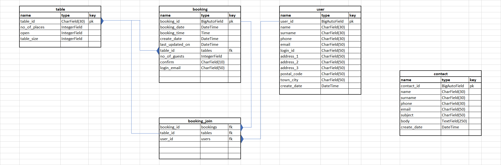
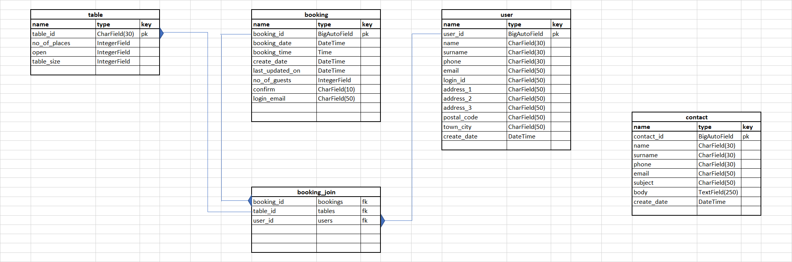

# Herb's Restaurant Booking App


## Problem Statement
1. The user would like to book one or more guests for a meal in a restaurant at a particular time and date


## User Stories
1. Site Navigation: As a **Site User** I can **easily navigate the site** so that **I can view the menu, sign up, and manage my bookings**
2. Admin Manage bookings: As a **Site Admin** I can **create, view, update and cancel bookings** so that **I can manage my table bookings**
3. Sign-up: As a **Site User** I can **register an account** so that **I can sign-in with username and password**
4. Reset password: As a **Site User** I can **reset my password myself** so that **I don't have to ask webmaster**
5. Sign-in with Social Networks: As a **Site User** I can **use a social network** so that **I can sign-in to the site**
6. View table availability: In order to **book a table** as a **Site User** I can **see available tables**
7. Make booking: As a **Site User** I can **make Date/time bookings**
8. Book multiple tables: As a **Site User** I can **make multiple table occupancy bookings** so that **I can take a larger party**
9. Change booking: As a **Site User** I can **update my booking** so that **I can increase or reduce the number of tables booked**
10. Change booking date: As a **Site User** I can **update my booking date** so that **I can change the date to earlier or later date**
11. Cancel booking: As a **Site User** I can **cancel a booking**
12. View menu: As a **Site User** I can **view the menu** so that **I can decide on meals beforehand**
13. Contact form: As a **Site User** I can **submit a contact form** so that **I can get support from the restaurant**
14. Admin Confirm bookings: As a **Site Admin** I can **approve bookings** so that **I can better plan bookings**
15. Password reset: As a **Site User** I can **request a password reset and receive email confirmation** so that **I can access my account if I have forgotten my password
16. Email Contact form: As a **Site User** I will **receive an email confirmation of my contact form submission**
17. Signup email verification: As a **Site User** I will **need to verify my signup via an email verification link**
18. About page: As a **Site User** I can **navigate to the About page** so that **I can view a brief intro to Herb’s Restaurant and its business hours
19. View Bookings: As a **Site User** I can **view all my booking** so that **I make better plan my events and also cancel or change bookings**
20. On Signup Add User: As a **Site User** when I **sign up** the app **will add my details to the user table**


## Model and Design

### Model

* The current data model:
  * The original intention was to use the `booking_join` table to link multiple bookings, for different dates and times, to a `table_id`
    * This functionality however was not implemented and will be a future enhancement
  * Currently, in order to link bookings to tables, a foreign key relationship was made between the `booking` and `table` tables


* The original data model design:
  * This model was the first plan for the project



### Design

* Wireframes for the project can be seen [here](/static/design/herbs_restaurant.pdf)


## Testing

### Django Tests

* Created test cases to test the BookingForm. Test file name: test_bookingform.py
    * Tests to confirm that the form is only valid if all required fields are completed
    * Tests to confirm that only the necessary field are displayed on the form
* Created test cases to test the ContactForm. Test file name: test_contactform.py
    * Tests are run to confirm that the form is only valid if all required fields are completed
    * Tests to confirm that only the necessary field are displayed on the form
    * Not tested: Confirm field is read-only/disabled.
* Created test cases to test that all view templates render
* Created test case to test that adding a contact or submitting a contact form works as expected
* Created test cases to verify that the user can:
    * Create a booking
    * Update/make changes to a booking
    * Delete a booking
    * Mark a booking as cancelled

### Manual Testing

* Tested the Home, Menu, About pages. These all work as expected.
* Tested that a user can make a booking
    * An email is sent to the restaurant admin advising of the new booking
    * The booking is listed on the user's booking listing
    * for each line item a **'Change'** and **'Cancel'** button is activated
* Tested that a user can change booking details
    * once a change is made to booking, if the booking had already been confirmed by restaurant admin, the status of the booking will be reset from **confirm='Yes'** to **confirm='No'**
* Tested that the user can delete a record
    * Delete option/button was replaced by the cancel button
    * On deleting a booking an email is sent to the restaurant admin
* Tested that the user can cancel a booking
    * When a user cancels a booking **confirm** is set to **'Cancel'**
    * The option to cancel a booking is preferable, as the record will still be visible to the admin
    * Once the user cancels the booking, the booking is no longer displayed to the user
    * On cancelling a booking an email is sent to the restaurant admin
    * Functionality can be added later to provide conditions permitting a user to delete a booking
* Tested viewing the OPEN TABLES VIEW.
    * Only open tables are displayed
* Tested the contact form
    * An email is sent to the admin with the content of the content form
    * The contact table is updated with the content of the content form
* Login/Sign up works as expected.
    * New users will receive and email to validate their account
* Date and time validation
    * Test that a valid date and time is entered.
    * Users may not enter past dates
    * User may not make or change bookings for the current day
* Table id (table number) validation
    * Test that user enters a valid table number

### Validator Testing

* CSS
    * No errors were returned by W3C validator on bus-casual-styles.css 
    
    * No errors were returned by W3C validator on styles.css
    

* Lighthouse
  
    * I ran the lighthouse report to rate my website's performance, accessibility, best practices and SEO.
    


## Bugs and Fixes

### Resolved
* Images not found when deployed to heroku
    * because some styles sheets and images definitions in the template were not in block tags
    * Also added `````` to all templates due to block end error 
* Styling and images not found when deployed
    * installed whitenoise package
* Fixed variable EMAIL_USE_TLS, was incorrect as EMAIL_USES_TLS (Thanks Ian Meigh for spotting it for me - post in Slack)
    * After hours of figuring out how "it" works, then going through error after error, the brain swells and the simplest typo is blocked from your sight
* BookingAdmin class -- confirm functions -- admin.py
    * previously working (somehow) with two parameters, ```def confirm_booking(self, queryset):```, when simply changing confirm from 0 to 1 and vice versa. 0 being No and 1 being Yes.
    * after changing the field type from integer to char and adding an additional option of 'cancel' I received this error:
        * confirm_booking() takes 2 positional arguments but 3 were given
    * After scouring the web for possible causes I came up empty handed. I decided to look deeper into the detail and found my solution from looking into:
        * File "/workspace/.pip-modules/lib/python3.8/site-packages/django/contrib/admin/options.py", line 1408, in response_action response = func(self, request, queryset)
    * Adding 'request' as a second parameter solved the issue: ```def confirm_booking(self, request, queryset):```
* Booking template
    * after changing confirm field from integer to char in booking model I didn't remove the conditional statement from the booking template used to set confirm 0 to No and 1 to Yes. This displayed inconsistent values.
* TimeInput - when updating a booking the time was not pulled into the form
    * Cause: the format on the booking_time field was: ```format=('%h:%m')``` instead of ```format=('%H:%M')```
* User could add any table id to the booking form
    * Added checks to prevent booking for invalid table ids
* User could add bookings for past dates
    * Added checks to prevent users from adding bookings for past or current date. Only future bookings allowed.

### Unresolved
* created date is updating to current date on update of a record

## Technologies used

* HTML/CSS
* Javascript
* Python+Django
* Sqlite3
* Postgres
* Cloudinary
* GitHub
* GitPod

## Sources and References

### Website Design, Layout and function
- I used the "https://startbootstrap.com/previews/business-casual" as my template
- I used the part of social network links layout from my tourguide project
- The home page image I is from Pexel and icons_for_free
 - pexels-foodie-factor-551997.avif
 - pexels-rachel-claire-4577396.avif
 - pexels-nataliya-vaitkevich-5605543.avif
 - pexels-min-an-1482803.avif
 - pexels-dana-tentis-1213710.avif
 - pexels-rajesh-tp-1633578.avif
- Used convertio.co, compressjpeg.com, cleancss.com, geeksforgeeks.org

### User account sign up and login functionality
- Guided by django blog project
- Support from stackoverflow.com, web.dev, slack
- django documentation

### General support
- djangoproject.com
- geeksforgeeks.org
- w3schools.com
- Slack
- stackoverflow
- simpleisbetterthancomplex.com

### Other
- https://djecrety.ir/ - used to generate random security key


## Deployment

### Heroku requirements
* The App live link is:
  * https://herbsrestaurantv2.herokuapp.com/ 

* The project was deployed to Heroku using the following steps.

* Log in to Heroku and create an App
* In the Resources Tab add a database - Heroku Postgres - Hobby Dev
   * Verify, in the settings tab, that the DATABASE_URL has been added to config vars
   * Add a new key, SECURITY_KEY, the value cand be a random value but I used a value generated by https://djecrety.ir/ 
* static and media files are stored on Cloudinary
  *	Create a cloudinary account (free)
  *	Copy the cloudinary API Environment variable
  *	In settings tab, config vars, add a new key CLOUDINARY_URL
    * for the value, copy and paste the API Environment variable from the cloudinary account

### Settings

For cloudinary to function add the following in the settings.py file:
* In "INSTALLED_APPS" add 'cloudinary_storage' and 'cloudinary' before and after 'django.contrib.staticfiles' respectively
* Under the STATIC_URL entry add:
   * STATICFILES_STORAGE = 'cloudinary_storage.storage.StaticHashedCloudinaryStorage'
   * STATICFILES_DIRS = [os.path.join(BASE_DIR, 'static')]
   * STATICFILES_FINDERS = (
     * 'django.contrib.staticfiles.finders.FileSystemFinder',
     * 'django.contrib.staticfiles.finders.AppDirectoriesFinder',
     * )

### Procfile
* Create a "Procfile" in the workspace and add the following line in the file:
  * web: gunicorn herbs.wsgi

### Deploy
* Once all settings are in place deploy in Heroku
  * At the Deploy tab, select GitHub as the deployment method.
  * Select your repository name and click Search. Once it is found, click Connect.
  * Select the branch you want to deploy, then click Deploy Branch.


## The Final Look

### The Home Page


### The Menu Page


### The About Page


### The Contact Form


### The Bookings Page


#### Make a Booking


#### Change a Boooking


#### View Open Tables

